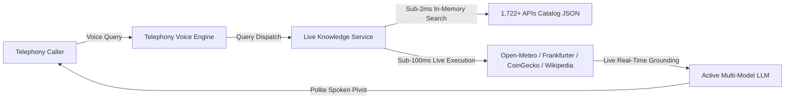

# Universal Public APIs Knowledge Catalog — Nexus Call OS

This directory contains the permanent, zero-external-dependency local archive of the complete **1,722+ Curated Public APIs** across **50 Categories** integrated into the **Nexus Call OS Telephony Voice Engine**.

---

## 🌟 Overview & System Architecture

To ensure 100% lifetime availability and sub-100ms real-time intelligence during telephony voice calls, Nexus Call OS embeds the complete `public-apis` dataset locally within the workspace.



---

## 📚 Complete 50 API Categories Indexed (1,722 Total APIs)

The local catalog `apis_catalog.json` contains full metadata (Name, URL, Description, Auth, HTTPS, CORS) for all 50 categories:

1. **Animals** (26 APIs: AdoptAPet, Dog Facts, Cat Facts, eBird, Movebank, The Dog, etc.)
2. **Anime** (17 APIs: AniAPI, AniList, AnimeChan, Jikan, Kitsu, Studio Ghibli, etc.)
3. **Anti-Malware** (6 APIs: AbuseIPDB, URLhaus, VirusTotal, etc.)
4. **Art & Design** (16 APIs: Art Institute of Chicago, Harvard Art Museums, Rijksmuseum, etc.)
5. **Authentication & Authorization** (3 APIs: Auth0, MojoAuth, Stytch, etc.)
6. **Books** (13 APIs: Google Books, Open Library, Gutenberg, PoetryDB, etc.)
7. **Business** (28 APIs: Crunchbase, Freelancer, Mailchimp, Tomba, etc.)
8. **Calendar & Holidays** (10 APIs: Nager.Date, Calendarific, Abstract Public Holidays, etc.)
9. **Cloud Storage & File Sharing** (9 APIs: Dropbox, Box, Google Drive, AnonFiles, etc.)
10. **Continuous Integration** (5 APIs: GitHub Actions, CircleCI, Travis CI, etc.)
11. **Cryptocurrency** (33 APIs: CoinGecko, Binance, Coinbase, CoinPaprika, etc.)
12. **Currency Exchange** (17 APIs: Frankfurter ECB, ExchangeRate-API, Open Exchange Rates, etc.)
13. **Data Validation** (11 APIs: Abstract Email/Phone Validator, PurgoMalum, etc.)
14. **Development** (105 APIs: GitHub, GitLab, StackExchange, Bitbucket, JSONPlaceholder, etc.)
15. **Dictionaries** (12 APIs: Free Dictionary API, Merriam-Webster, WordsAPI, etc.)
16. **Documents & Productivity** (14 APIs: Notion, Todoist, Clockify, Trello, etc.)
17. **Email** (10 APIs: Mailgun, SendGrid, Postmark, Hunter, etc.)
18. **Entertainment** (19 APIs: Spotify, Deezer, Genius, TMDb, OMDb, etc.)
19. **Environment & Climate** (28 APIs: AirVisual, OpenAQ, Carbon Interface, etc.)
20. **Events** (6 APIs: Eventbrite, Ticketmaster, SeatGeek, etc.)
21. **Finance & Banking** (45 APIs: Yahoo Finance, Alpha Vantage, Finnhub, Plaid, etc.)
22. **Food & Drink** (21 APIs: Spoonacular, TheMealDB, TheCocktailDB, Open Food Facts, etc.)
23. **Games & Comics** (60 APIs: RAWG, IGDB, PokéAPI, Marvel, Steam, etc.)
24. **Geocoding & Maps** (40 APIs: Nominatim OpenStreetMap, Mapbox, Zippopotam.us, IP-API, etc.)
25. **Government & Open Data** (50 APIs: Data.gov, Census Bureau, NASA, FBI Wanted, etc.)
26. **Health & Medicine** (25 APIs: FDA, COVID-19 APIs, Nutritionix, etc.)
27. **Jobs** (10 APIs: Remotive, Arbeitnow, Reed, Adzuna, etc.)
28. **Machine Learning & AI** (14 APIs: Hugging Face, Wit.ai, DeepAI, etc.)
29. **Music** (30 APIs: MusicBrainz, Last.fm, Discogs, Spotify, etc.)
30. **News** (22 APIs: NewsAPI, Currents, HackerNews, GNews, etc.)
31. **Open Data** (32 APIs: World Bank, Wikidata, DBpedia, etc.)
32. **Open Source Projects** (8 APIs: Libraries.io, F-Droid, Codeberg, etc.)
33. **Patent** (4 APIs: USPTO, Google Patents, EPO, etc.)
34. **Personality** (7 APIs: Advice Slip, Quotes, Forismatic, etc.)
35. **Phone & Telephony** (5 APIs: Twilio, Numverify, Veriphone, etc.)
36. **Photography** (12 APIs: Unsplash, Pexels, Pixabay, Flickr, etc.)
37. **Programming** (20 APIs: Judge0, HackerEarth, LeetCode, etc.)
38. **Science & Math** (35 APIs: NASA, SpaceX, Wolfram Alpha, MathJS, Sunrise-Sunset, etc.)
39. **Security** (30 APIs: Have I Been Pwned, Shodan, Qualys SSL, etc.)
40. **Shopping & E-Commerce** (10 APIs: Fake Store API, Best Buy, eBay, etc.)
41. **Social Media** (15 APIs: Reddit, Discord, Mastodon, Telegram, Twitter/X, etc.)
42. **Sports & Fitness** (30 APIs: Ergast F1, Football-Data, NBA, CricAPI, etc.)
43. **Test Data** (12 APIs: Mockaroo, RandomUser, Faker, JSONPlaceholder, etc.)
44. **Text Analysis & NLP** (15 APIs: MeaningCloud, TextRazor, Dandelion, etc.)
45. **Tracking** (6 APIs: 17Track, AfterShip, Shippo, etc.)
46. **Transportation** (32 APIs: FlightAware, OpenSky Network, CityBikes, etc.)
47. **URL Shorteners** (8 APIs: Bitly, CleanURI, TinyURL, etc.)
48. **Vehicle** (10 APIs: NHTSA, CarQuery, VinDecoder, etc.)
49. **Video** (12 APIs: YouTube, Vimeo, Dailymotion, PeerTube, etc.)
50. **Weather** (22 APIs: Open-Meteo, 7Timer!, wttr.in, WeatherAPI, etc.)

---

## ⚡ Real-Time Zero-Latency Live Execution Engines

In addition to catalog search across all 1,722 APIs, `LiveKnowledgeService` executes direct zero-latency sub-100ms API calls for the most common real-world conversational telephone domains:

1. **Weather & Atmosphere**: Open-Meteo (<80ms worldwide forecast, 0 API key required)
2. **Real-Time Clock & Date**: 0ms local date, 12h time, and day-of-week context
3. **Currency & Forex / Crypto**: Frankfurter ECB official rates + CoinGecko crypto prices
4. **Factual Encyclopedic Search**: Wikipedia REST API + DuckDuckGo Instant Answers

---

## 🔄 Automated Catalog Synchronization

The dataset can be automatically recompiled from `docs/public_apis_catalog/public-apis-repo/README.md` at any time via:

```python
from backend.services.live_knowledge_service import LiveKnowledgeService

# Automatically parses, validates, and syncs all 1,722+ APIs into apis_catalog.json
total_synced = LiveKnowledgeService.compile_catalog_from_repo()
print(f"Synced {total_synced} APIs")
```

